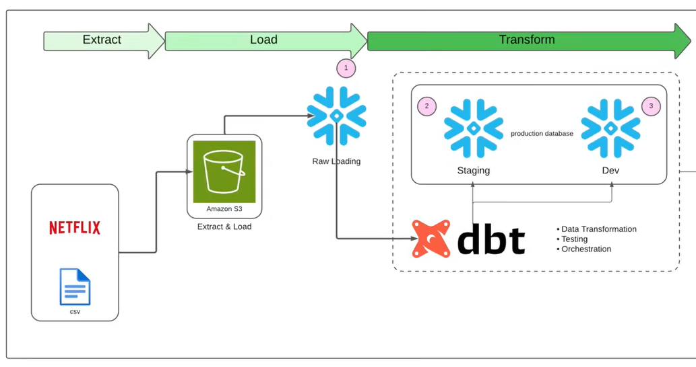

# Netflix Data Analysis with DBT

A production-ready data engineering project implementing a modern ELT pipeline using DBT (Data Build Tool) to transform and model MovieLens 20M dataset into a dimensional data warehouse.



## Dataset

**Source**: [MovieLens 20M Dataset](https://grouplens.org/datasets/movielens/20m/)

The dataset contains:
- 20 million ratings and 465,000 tag applications
- Applied to 27,000 movies by 138,000 users
- Genome scores providing movie-tag relevance data

## Architecture Overview

### Data Flow
```
Raw Data (CSV) → Snowflake (Raw Schema) → DBT Transformations → Data Warehouse (Dev Schema)
```

### DBT Project Structure
```
models/
├── staging/          # Raw data ingestion layer (Views)
├── dim/              # Dimension tables (Tables)
├── fct/              # Fact tables (Tables)
└── mart/             # Business-specific data marts (Tables)
```

## Tech Stack

- **Data Warehouse**: Snowflake
- **Transformation**: DBT Core
- **Version Control**: Git
- **Language**: SQL (Jinja-templated)
- **Testing**: DBT native testing framework

## Project Components

### Staging Layer
Ingests raw data into standardized views:
- `src_movies` - Movie metadata
- `src_ratings` - User ratings
- `src_tags` - User-generated tags
- `src_genome_scores` - Tag relevance scores
- `src_genome_tags` - Tag definitions
- `src_links` - External ID mappings

**Materialization**: `view`

### Dimensional Layer

**Dimension Tables**:
- `dim_movies` - Cleansed movie metadata with genre arrays
- `dim_users` - Deduplicated user records
- `dim_genome_tags` - Normalized tag labels
- `dim_movies_with_tags` - Movies enriched with tag data

**Fact Tables**:
- `fct_ratings` - User movie ratings with timestamps
- `fct_genome_scores` - Movie-tag relevance scores (0-1)
- `fact_ep_movie_with_tags` - Enriched fact table with tag metadata

**Materialization**: `table`

### Mart Layer
Business-focused models:
- `mart_movie_releases` - Combines ratings with seed release date data

### Advanced Features

#### Snapshots (SCD Type 2)
- `snap_tags` - Historical tracking of user tags using timestamp strategy
- Captures tag changes over time with valid from/to dates

#### Custom Macros
- `generate_schema_name` - Dynamic schema naming
- `no_nulls_in_columns` - Generic test for validating data quality

#### Testing
- **Generic Tests**: Built-in tests (unique, not_null, relationships, accepted_values)
- **Singular Tests**: Custom SQL-based tests
  - `relevance_score_test.sql` - Validates genome score ranges

#### Analysis
- `movie_analysis.sql` - Ad-hoc analytical queries (non-materializing)

#### Seeds
- `seed_movie_release_dates.csv` - Static reference data for release dates

## Getting Started

### Prerequisites
```bash
# Install DBT
pip install dbt-snowflake

# Clone repository
git clone <repo-url>
cd netflix-dbt
```

### Configuration

1. **Set up profiles.yml** (in `~/.dbt/` or project root):
```yaml
default:
  outputs:
    dev:
      type: snowflake
      account: <your-account>
      user: <your-user>
      password: <your-password>
      role: <your-role>
      database: <your-database>
      warehouse: <your-warehouse>
      schema: dev
      threads: 4
  target: dev
```

2. **Install dependencies**:
```bash
dbt deps
```

### Running the Pipeline

```bash
# Run all models
dbt run

# Run specific model
dbt run --select dim_movies

# Run tests
dbt test

# Generate documentation
dbt docs generate
dbt docs serve

# Run snapshots
dbt snapshot
```

## Data Lineage

```
┌─────────────┐
│  Raw Tables │
└──────┬──────┘
       │
       ▼
┌──────────────┐
│   Staging    │  (Views)
│  src_*       │
└──────┬───────┘
       │
       ├─────────┬──────────┐
       ▼         ▼          ▼
   ┌────────┐ ┌──────┐  ┌──────┐
   │  dim_  │ │ fct_ │  │mart_ │
   │ tables │ │tables│  │tables│
   └────────┘ └──────┘  └──────┘
```

## Key DBT Features Demonstrated

- **Materialization Strategies**: Views, Tables, Incremental (ready)  
- **Jinja Templating**: Dynamic SQL generation  
- **Macros**: Reusable code blocks for DRY principles  
- **Tests**: Data quality validation (generic + singular)  
- **Snapshots**: SCD Type 2 implementation  
- **Seeds**: Static reference data management  
- **Documentation**: Schema descriptions and column-level metadata  
- **Sources**: Raw data abstraction layer  
- **Refs**: Dependency management between models  
- **Packages**: DBT Utils integration  

## Testing Coverage

- **Schema Tests**: Defined in `models/schema.yml`
- **Relationship Tests**: Foreign key validation between fact and dimension tables
- **Custom Tests**: Data range validation for scores
- **Macro Tests**: Null value detection across all columns

## Data Quality

- Primary key uniqueness enforced
- Not-null constraints on critical columns
- Referential integrity between facts and dimensions
- Custom validation for relevance scores (0-1 range)

## Dependencies

Defined in `packages.yml`:
```yaml
packages:
  - package: dbt-labs/dbt_utils
    version: 1.0.0
```

## Use Cases

- Movie recommendation analysis
- User behavior tracking
- Genre trend analysis
- Tag relevance modeling
- Historical data change tracking (via snapshots)

## Best Practices Implemented

1. **Layer Separation**: Clear staging → dimensional → mart layers
2. **Naming Conventions**: Prefixes (`src_`, `dim_`, `fct_`, `mart_`)
3. **Documentation**: Comprehensive schema descriptions
4. **Testing**: Multi-layered validation strategy
5. **Modularity**: Reusable macros and DRY principles
6. **Version Control**: Git-based workflow

## Contributing

1. Create feature branch
2. Make changes following naming conventions
3. Add tests for new models
4. Update documentation
5. Submit pull request

## License

This project is open source and available for educational purposes.

## Author

**Nitish Reddy**
